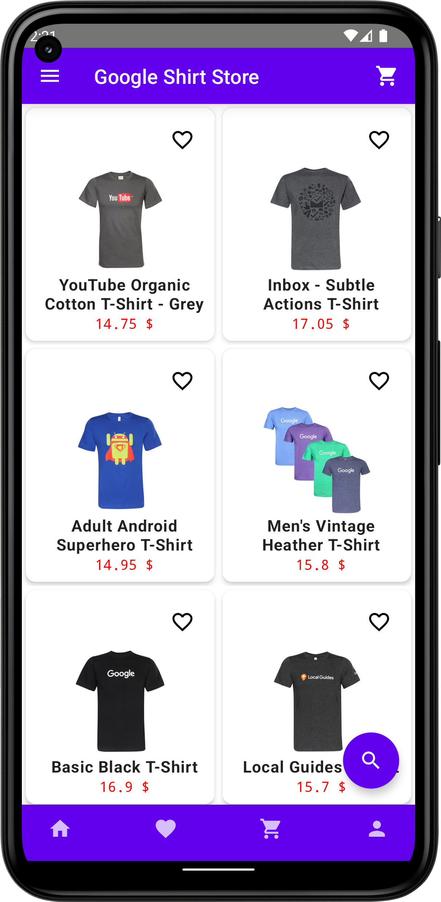
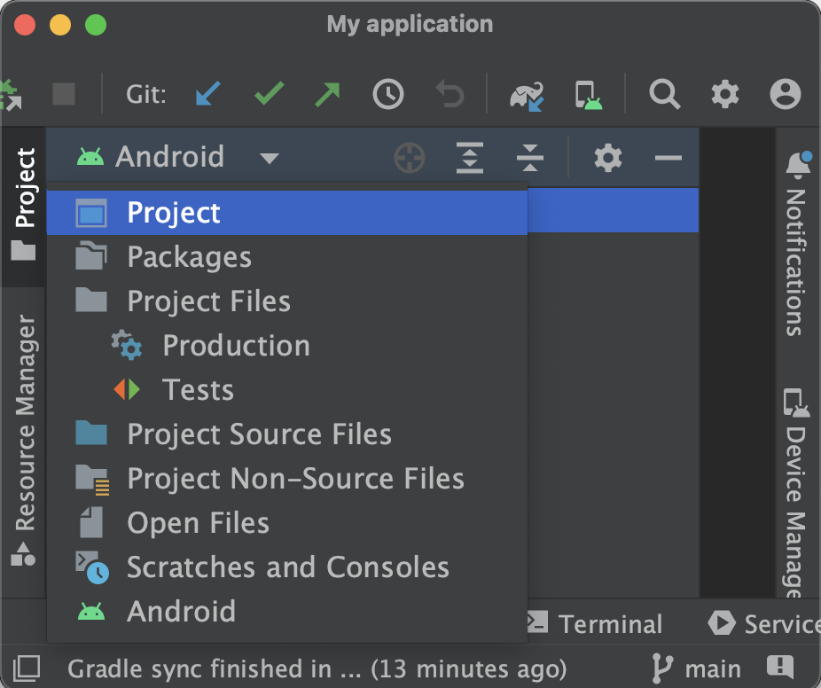
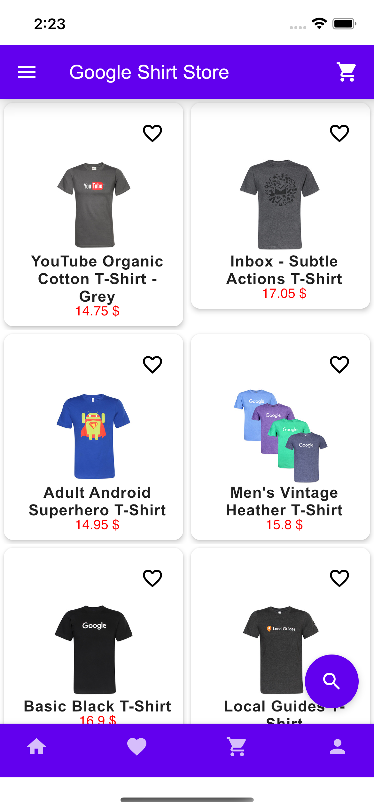

   [](https://confluence.jetbrains.com/display/ALL/JetBrains+on+GitHub)
[](https://opensource.org/licenses/Apache-2.0)
# [Compose Multiplatform](https://github.com/JetBrains/compose-multiplatform) mobile application

> **Note**
> Compose Multiplatform for iOS is in Alpha. It may change incompatibly and require manual migration in the future.
> We would appreciate your feedback on it in the public Slack channel [#compose-ios](https://kotlinlang.slack.com/archives/C0346LWVBJ4/p1678888063176359).
> If you face any issues, please report them on [GitHub](https://github.com/JetBrains/compose-multiplatform/issues).


This is an exmple based in [ComposeMultiplatform template](JetBrains/compose-multiplatform-ios-android-template), is using Ktor, Serialization and coroutines.

the result is the fallowing image: <br />


 
You can use this template to start developing your own [Compose Multiplatform](https://github.com/JetBrains/compose-multiplatform#readme) mobile application targeting Android and iOS.
Follow our tutorial below to get your first Compose Multiplatform app up and running.
The result will be a [Kotlin Multiplatform](https://kotlinlang.org/docs/multiplatform.html) project that uses Compose Multiplatform UI framework.

## Set up the environment

> **Warning**
> You need a Mac with macOS to write and run iOS-specific code on simulated or real devices.
> This is an Apple requirement.

To work with this template, you need the following:

* A machine running a recent version of macOS
* [Xcode](https://apps.apple.com/us/app/xcode/id497799835)
* [Android Studio](https://developer.android.com/studio)
* [Kotlin Multiplatform Mobile plugin](https://plugins.jetbrains.com/plugin/14936-kotlin-multiplatform-mobile)
* [CocoaPods dependency manager](https://kotlinlang.org/docs/native-cocoapods.html)

### Check your environment

Before you start, use the [KDoctor](https://github.com/Kotlin/kdoctor) tool to ensure that your development environment is configured correctly:

1. Install KDoctor with [Homebrew](https://brew.sh/):

    ```text
    brew install kdoctor
    ```

2. Run KDoctor in your terminal:

    ```text
    kdoctor
    ```

   If everything is set up correctly, you'll see a valid output:
   
   ```text
   Environment diagnose (to see all details, use -v option):
   [✓] Operation System
   [✓] Java
   [✓] Android Studio
   [✓] Xcode
   [✓] Cocoapods
   
   Conclusion:
     ✓ Your system is ready for Kotlin Multiplatform Mobile Development!
   ```
   
   Otherwise, KDoctor will highlight which parts of your setup still need configuration and suggest how to fix them.

## Examine the project structure

Open the project in Android Studio and switch the view from **Android** to **Project** to see all the files and targets belonging to the project:



Your Compose Multiplatform project includes three modules:

### shared

This is a Kotlin module that contains the logic common for both Android and iOS applications, the code you share between platforms.

This `shared` module is also where you write your Compose Multiplatform code.
In `shared/src/commonMain/kotlin/App.kt`, you can find the shared root `@Composable` function for your app.

It uses Gradle as the build system. You can add dependencies and change settings in `shared/build.gradle.kts`.
The `shared` module builds into an Android library and an iOS framework.

### androidApp

This is a Kotlin module that builds into an Android application. It uses Gradle as the build system.
The `androidApp` module depends on and uses the `shared` module as a regular Android library.

### iosApp

This is an Xcode project that builds into an iOS application.
It depends on and uses the `shared` module as a CocoaPods dependency.

## Run your application

### On Android

To run your application on an Android emulator:

1. Ensure you have an Android virtual device available. Otherwise, [create one](https://developer.android.com/studio/run/managing-avds#createavd).
2. In the list of run configurations, select `androidApp`.
3. Choose your virtual device and click **Run**:

   <br />
   
   

<details>
  <summary>Alternatively, use Gradle</summary>

To install an Android application on a real device Android device or an emulator, run `./gradlew installDebug` in the terminal.

</details>

### On iOS

#### Running on a simulator

To run your application on an iOS simulator in Android Studio, modify the `iosApp` run configuration:

1. In the list of run configurations, select **Edit Configurations**:

   

2. Navigate to **iOS Application** | **iosApp**.
3. In the **Execution target** list, select your target device. Click **OK**:

   

4. The `iosApp` run configuration is now available. Click **Run** next to your virtual device:

<br/>
    

